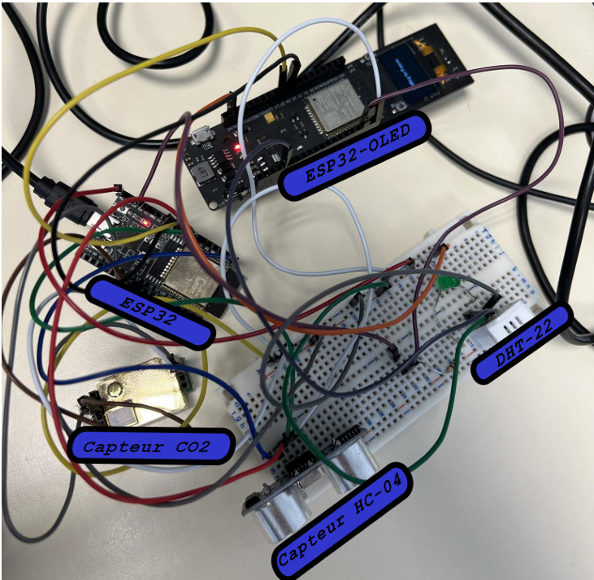
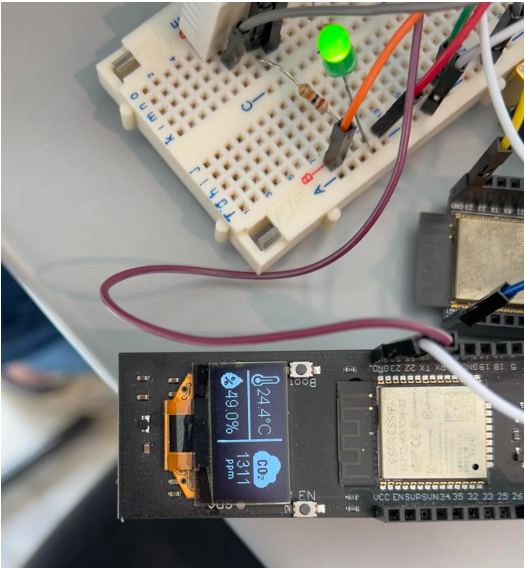
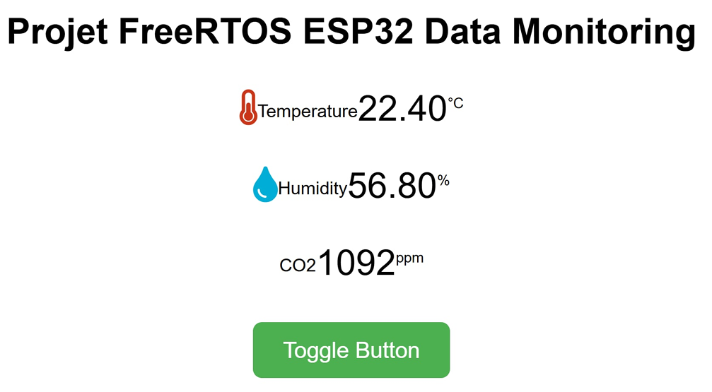

# README

## Introduction

This project aims to develop a real-time embedded system using FreeRTOS on ESP32 boards. The system reads values from temperature, humidity, and CO2 sensors and displays them when a person is detected using an ultrasonic sensor. The project involves several key techniques and components, including UART, SPI, and I2C peripherals, and real-time task scheduling.

  

## Objectives

- Read temperature, humidity, and CO2 sensor values.
- Detect the presence of a person using an ultrasonic sensor.
- Display sensor values only when a person is detected.
- Establish communication between two ESP32 boards.
- Implement a producer-consumer system for efficient data handling.

## Components and Techniques

### Hardware

- **ESP32 Boards**: Two ESP32 boards are used to handle different tasks and communicate with each other.
- **Sensors**: Temperature, humidity, and CO2 sensors are used to gather environmental data.
- **Ultrasonic Sensor**: Detects the presence of a person.

### Communication Protocols

- **UART**: Used for serial communication between the two ESP32 boards.

### Software

- **FreeRTOS**: An open-source real-time operating system for embedded devices.
- **Producer-Consumer Pattern**: Ensures efficient data handling and task scheduling.

## System Design

### Communication Between ESP32 Boards

The two ESP32 boards communicate via a serial interface (UART). One board acts as the master, handling the ultrasonic sensor and determining when to display the sensor values. The other board acts as the slave, reading the temperature, humidity, and CO2 sensor values and sending them to the master board.

### Task Scheduling

FreeRTOS is used to manage task scheduling in real-time. The system includes producer tasks that read sensor data and publish it to buffers, and consumer tasks that read data from the buffers and process it as needed.

#### Producer Tasks

- **Sensor Data Acquisition**: Tasks that read data from the temperature, humidity, and CO2 sensors and publish this data to shared buffers.

#### Consumer Tasks

- **Data Display**: Tasks that read data from the buffers and display it when a person is detected by the ultrasonic sensor.

## Implementation

### Setup

1. **ESP32 Boards**: Ensure both ESP32 boards are properly set up with the necessary libraries and drivers.
2. **Sensors**: Connect the temperature, humidity, CO2, and ultrasonic sensors to the ESP32 boards.
3. **FreeRTOS**: Set up FreeRTOS on the ESP32 boards, configuring tasks for data acquisition and display.

### Compilation and Deployment

1. Compile the code using the appropriate toolchain for ESP32.
2. Flash the compiled code to the ESP32 boards using the ESP32 flashing tool.
3. Monitor the system to ensure tasks are scheduled correctly and data is displayed when a person is detected.

## Output 

  

## Server to Monitor Data

A server was used to monitor the various data with a refreshing rate of 1 second.

  

## Conclusion

This project demonstrates the implementation of a real-time embedded system using FreeRTOS on ESP32 boards. By utilizing various communication protocols and task scheduling techniques, the system efficiently reads and displays sensor data based on the presence of a person. This setup can be extended to other applications requiring real-time data processing and display.